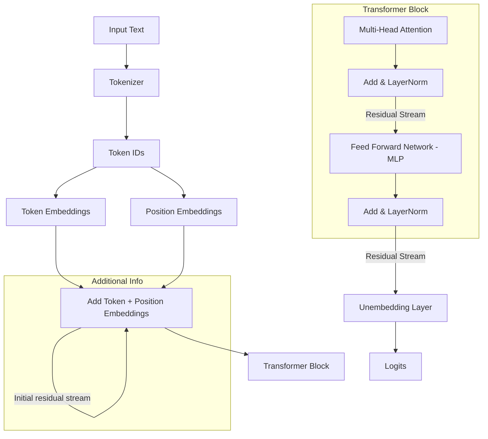
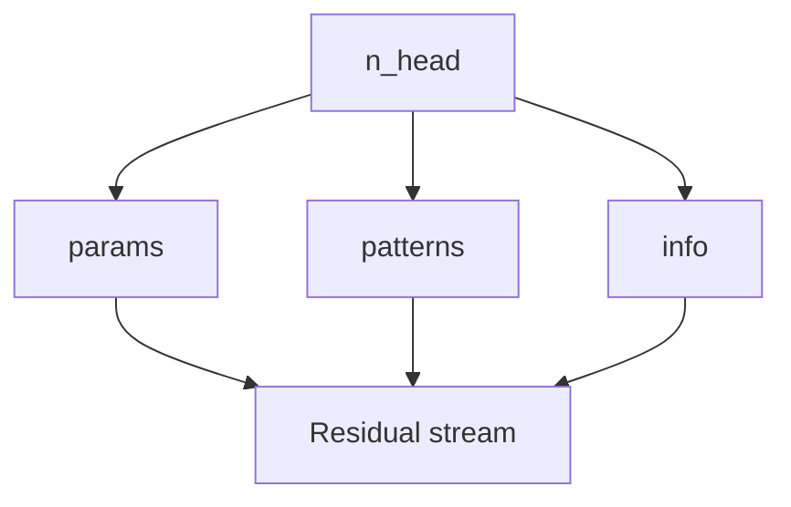
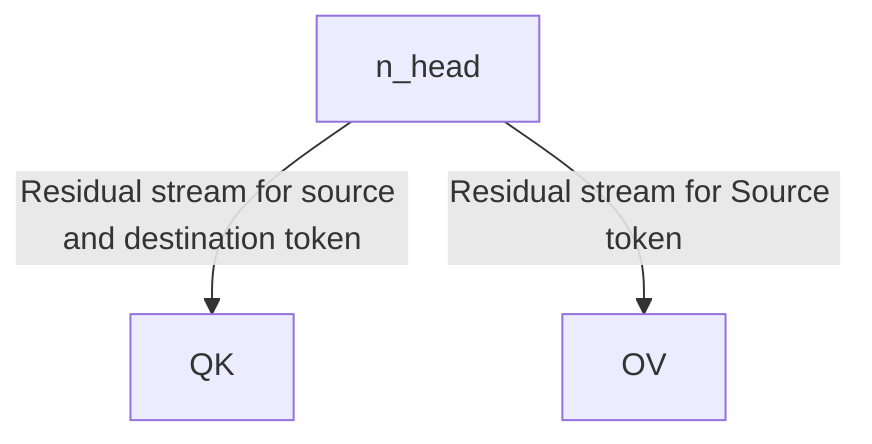

# Clean Transformer Implementation

Type: Study
Reviewed?: Not started
Topics: Mechanistic Interpretability (https://www.notion.so/Mechanistic-Interpretability-1c1151d4acc880bdb0a9fe6f6550f69f?pvs=21)
Related Notes: Transformers: Tokenization (https://www.notion.so/Transformers-Tokenization-18d151d4acc8808b8576cb8f9dd44cb2?pvs=21), Transformers (https://www.notion.so/Transformers-192151d4acc880d3901fc9e6b094fa4c?pvs=21), Transformers Reference (https://www.notion.so/Transformers-Reference-1b4151d4acc8807b8866d1602c33aa94?pvs=21)

# Theory

## High Level Architecture


## **Residual stream**

The residual stream is the sum of all previous outputs of layers of the model, is the input to each new layer. It has shape `[batch, seq_len, d_model]` (where `d_model` is the length of a single embedding vector).

The initial value of the residual stream is denoted  $x_0$  in the diagram, and $x_i$ are later values of the residual stream (after more attention and MLP layers have been applied to the residual stream).

> So we can say $x_o$  is the initial residual stream composing of $x_{embed}$ (token embeddings) and $x_{pos}$ (positional embedings)
> 

Residual stream : carries info between layers, makes model remember things

### High Level of Residual Stream Flow



## Attention

First we have attention. This moves information from prior positions in the sequence to the current token.

We do this for *every* token in parallel using the same parameters. The only difference is that we look backwards only (to avoid "cheating"). This means later tokens have more of the sequence that they can look at.

Attention layers are the only bit of a transformer that moves information between positions (i.e. between vectors at different sequence positions in the residual stream).

### Constituents of Attention

`n_heads` → arbitrary number of heads



### Circuits of Attention head



> Attention layers are effectively our way of telling transformer ***don't impose a prior of locality, but instead develop your own algorithm to figure out which tokens are important to which other tokens in any given sequence***
> 

### Single head


## MLP


## LayerNorm


# Implementation

```python
from dataclasses import dataclass

@dataclass
class Config:
    d_model: int = 768
    debug: bool = True
    layer_norm_eps: float = 1e-5
    d_vocab: int = 50257
    init_range: float = 0.02
    n_ctx: int = 2048
    d_head: int = 64
    d_mlp: int = 3072
    n_heads: int = 12
    n_layers: int = 12
```

- Layer Norm
    
    
    
- Embed
    
    ```python
    tokens = t.tensor([
        [1, 2, 3],   # First sequence (3 tokens)
        [4, 5, 6]    # Second sequence (3 tokens)
    ])  # Shape: [2, 3]
    
    ```
    
    Here:
    •	The first sequence consists of token IDs `. 	•	The second sequence consists of token IDs` .
    •	The shape of this tensor is `(2, 3)` indicating a batch size of 2 and a sequence length of 3.
    
    What Happens Internally?
    1.	Indexing into W_E: The method retrieves the corresponding rows from `W_E` based on the token IDs in `tokens`.
    •	For example:
    •	Token ID `1` retrieves row `1` from `W_E`.
    •	Token ID `2` retrieves row `2` from `W_E`.
    •	And so forth.
    2.	Output Shape: The resulting tensor will have shape `(2, 3, 512)`:
    •	2: Batch size (two sequences).
    •	3: Sequence length (three tokens per sequence).
    •	512: Embedding dimensionality (each token is represented as a vector with 512 dimensions).
    
    Example Output Structure
    If we assume that after initialization and some training/updates to the weights in `W_E`, we get:
    
    ```python
    embeddings = [
        [
            [0.1, -0.2, ..., ...],   # Embedding for token ID 1
            [0.5, 0.8, ..., ...],    # Embedding for token ID 2
            [0.3, -0.4, ..., ...]    # Embedding for token ID 3
        ],
        [
            [0.6, -0.1, ..., ...],    # Embedding for token ID 4
            [0.9, -0.5, ..., ...],    # Embedding for token ID 5
            [0.4, 0.7, ..., ...]      # Embedding for token ID 6
        ]
    ]
    
    ```
    


